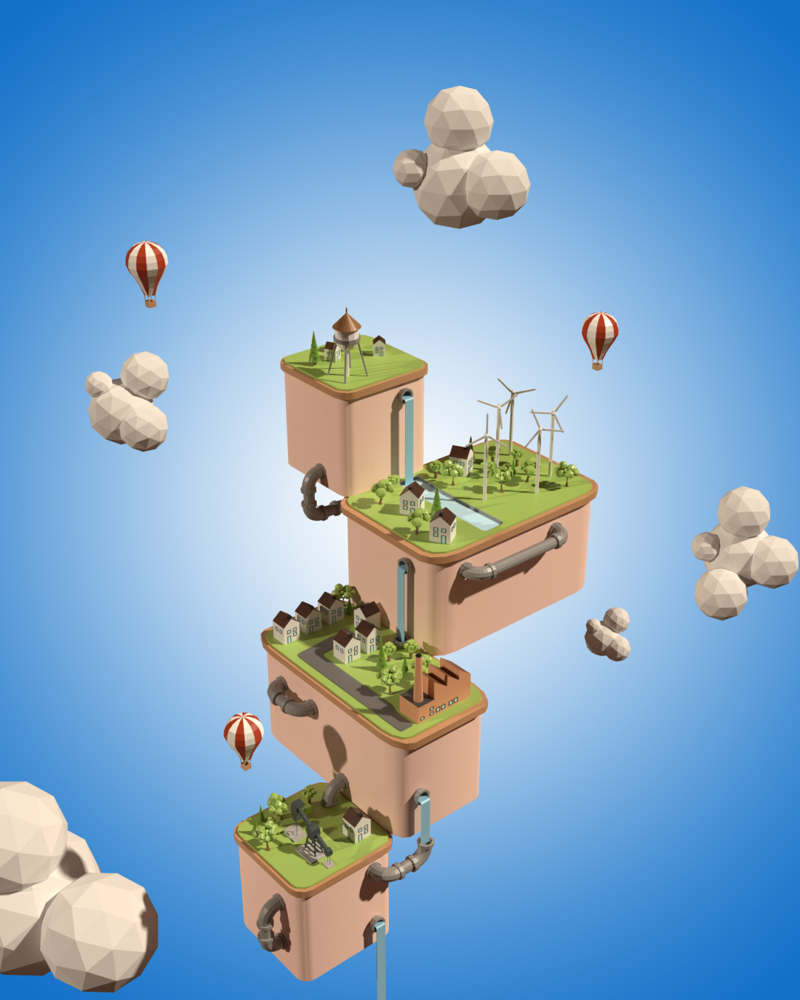
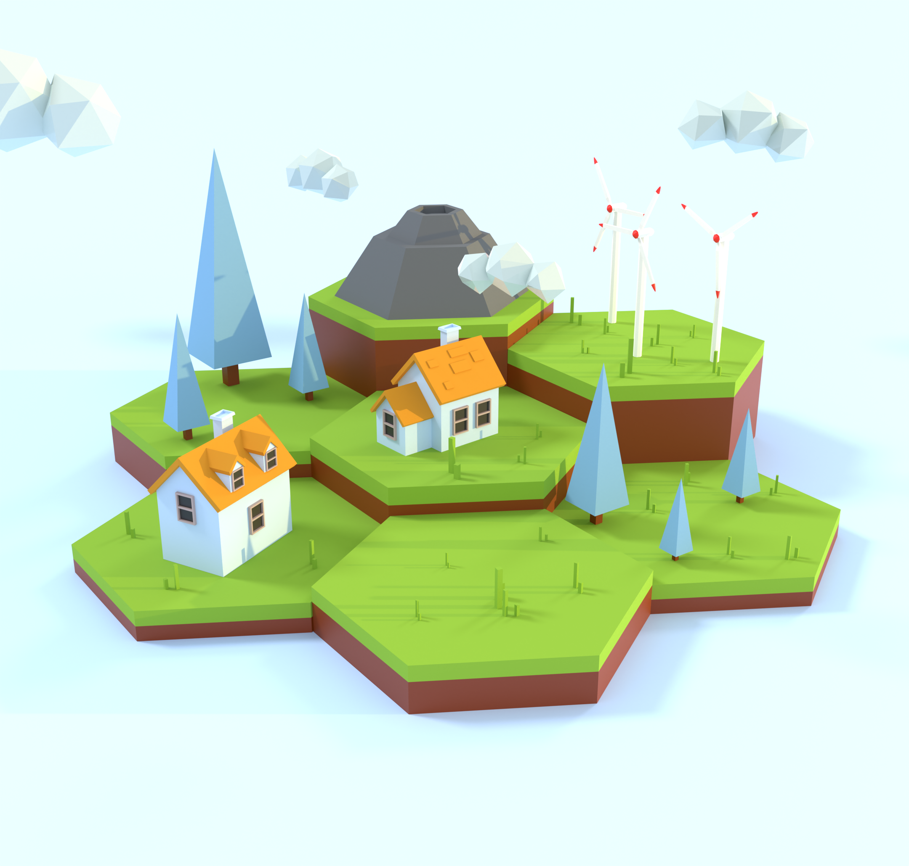
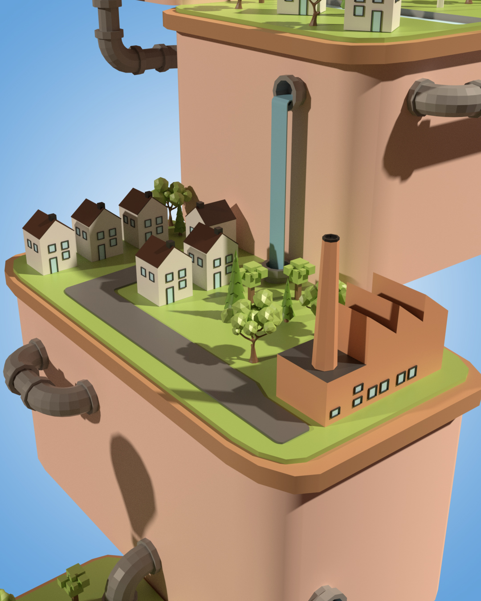
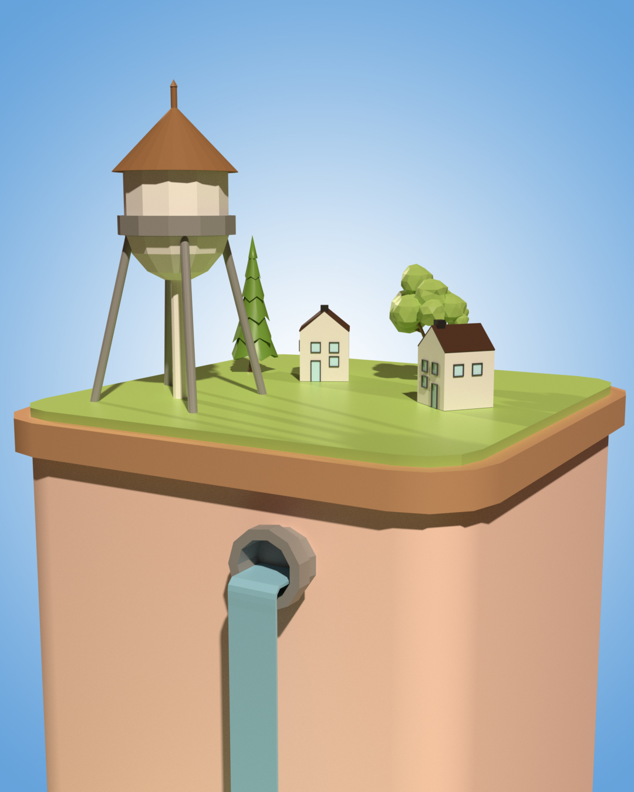

# Low Poly Floating Island
Low Poly Floating Island is a 3D Blender project. Created by watching a youtube tutorial. Watch the tutorial [here](https://youtu.be/OQ8IvjI5JP0).

</img>

  

</img>

<strong>This one I created inspired by an artwork I saw on Instagram.</strong>

  

</img>

  

</img>

  

</img>

  

